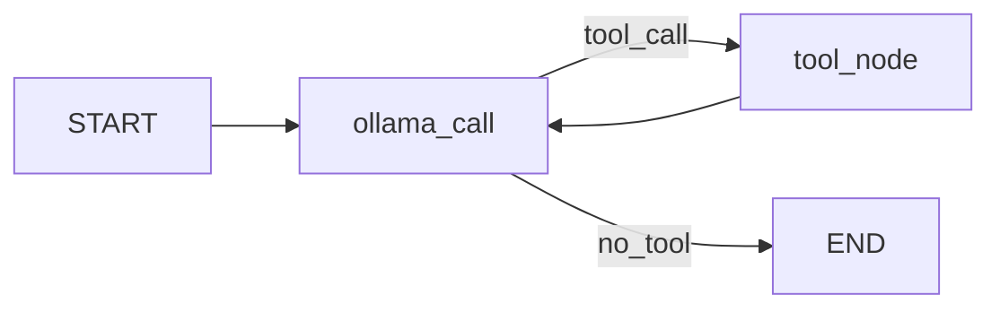

# Simple RAG - Sistema de Recuperação e Geração Aumentada

Sistema de RAG (Retrieval-Augmented Generation) que utiliza LangChain, Ollama e LangGraph para criar um agente conversacional com acesso a documentos médicos.

## Descrição

Este projeto implementa um agente de IA que combina:
- **Retrieval**: Busca semântica em documentos usando embeddings
- **Generation**: Geração de respostas usando LLM (Llama 3.1)
- **Tools**: Ferramentas customizadas (calculadora e recuperação de documentos)

O agente atua como um assistente médico, respondendo perguntas com base em documentos de anamnese armazenados localmente.

## Pré-requisitos

- Python 3.8+
- Ollama instalado e rodando (com modelo `llama3.1:8b`)
- Servidor Ollama acessível (padrão: `http://localhost:11434`)

### Instalar Ollama

#### Linux

```bash
curl -fsSL https://ollama.com/install.sh | sh
```

Ou manualmente:
```bash
# Download do binário
curl -L https://ollama.com/download/ollama-linux-amd64 -o ollama
chmod +x ollama
sudo mv ollama /usr/local/bin/
```

#### Windows

1. Baixe o instalador do Ollama em: https://ollama.com/download/windows
2. Execute o arquivo `.exe` e siga o assistente de instalação
3. O Ollama será instalado e iniciado automaticamente como serviço

#### macOS

```bash
# Via Homebrew
brew install ollama

# Ou baixe o .dmg em: https://ollama.com/download/mac
```

### Configurar e Iniciar Ollama

Após a instalação, inicie o serviço Ollama:

```bash
# Linux/macOS
ollama serve

# Windows: O serviço inicia automaticamente. Para iniciar manualmente:
# Procure por "Ollama" no menu iniciar e execute
```

O Ollama por padrão roda em `http://localhost:11434`

### Baixar o Modelo

Após instalar, baixe o modelo necessário:

```bash
ollama pull llama3.1:8b ou llama3.2:3b
```

Verifique se o modelo foi baixado:
```bash
ollama list
```

## Instalação

### 1. Clone o repositório

```bash
git clone <url-do-repositorio>
cd processamento-linguagem-natural-puc-minas
```

### 2. Crie um ambiente virtual (recomendado)

```bash
python -m venv venv
source venv/bin/activate  # Linux/Mac
# ou
venv\Scripts\activate     # Windows
```

### 3. Instale as dependências

```bash
pip install -r requirements.txt
```

### 4. Configure as variáveis de ambiente

```bash
# Copie o arquivo de exemplo
cp .env.example .env

# Edite o .env com suas configurações
# Especialmente OLLAMA_BASE_URL se não estiver usando localhost
```

Principais variáveis no `.env`:
```env
OLLAMA_BASE_URL=http://localhost:11434
OLLAMA_MODEL=llama3.1:8b
DATA_DIR=./data/anamnese
CHUNK_SIZE=1000
RETRIEVAL_K=4
LOG_LEVEL=INFO
```

## Estrutura do Projeto

```
processamento-linguagem-natural-puc-minas/
├── README.md
├── requirements.txt
├── requirements-dev.txt      # Dependências de desenvolvimento
├── .env.example              # Exemplo de configuração
├── .gitignore
│
├── docs/                     # Documentação
│   └── desenvolvimento.md    # Guia de desenvolvimento
│
├── data/
│   ├── README.md
│   └── anamnese/             # Documentos de anamnese
│       ├── camila-rodrigues-de-almeida.txt
│       ├── jose-carlos-da-silva.txt
│       └── maria-fernanda-oliveira-santos.txt
│
└── simple_rag/               # Pacote principal
    ├── __init__.py
    ├── config.py             # Configurações centralizadas
    ├── logger.py             # Sistema de logging
    ├── cli.py                # Interface CLI
    │
    ├── core/                 # Módulos principais
    │   ├── __init__.py
    │   ├── document_loader.py    # Carregamento de documentos
    │   ├── text_processor.py     # Divisão em chunks
    │   └── vectorstore.py        # Gestão do vector store
    │
    ├── agents/               # Agentes LangGraph
    │   ├── __init__.py
    │   └── medical_agent.py      # Agente médico principal
    │
    └── tools/                # Ferramentas para agentes
        ├── __init__.py
        ├── calculator.py         # add(), multiply()
        └── retriever.py          # retriever()
```

## Como Usar

### Executar a Aplicação (Modo Principal)

```bash
python -m simple_rag.cli
```

**Exemplo de interação:**
```
============================================================
Simple RAG - Assistente Médico
============================================================
Digite suas perguntas. Para sair, digite 'exit'

Você: Qual é o diagnóstico da paciente Camila?

Assistente: Com base nos documentos, a paciente Camila Rodrigues
de Almeida foi diagnosticada com lúpus eritematoso sistêmico...

Você: exit

Até logo!
```

### Testar Módulos Individuais

**Carregar e processar documentos:**
```bash
python -m simple_rag.core.document_loader
```

**Testar vector store:**
```bash
python -m simple_rag.core.vectorstore
```

**Testar agente:**
```bash
python -m simple_rag.agents.medical_agent
```

## Funcionalidades

### Ferramentas Disponíveis

O agente possui três ferramentas:

1. **add(a, b)**: Soma dois números inteiros
2. **multiply(a, b)**: Multiplica dois números inteiros
3. **retriever(query)**: Busca documentos relevantes no vector store usando similaridade semântica

### Fluxo do Agente



1. **ollama_call**: LLM analisa a mensagem e decide se precisa chamar uma ferramenta
2. **tool_node**: Executa a ferramenta solicitada
3. Loop continua até o LLM decidir responder diretamente ao usuário

## Configuração

### Configurar via .env

Todas as configurações estão centralizadas no arquivo `.env`:

```env
# Ollama Configuration
OLLAMA_BASE_URL=http://localhost:11434
OLLAMA_MODEL=llama3.1:8b
OLLAMA_TEMPERATURE=0

# Embedding Configuration
EMBEDDING_MODEL=sentence-transformers/all-MiniLM-L6-v2

# Document Processing
DATA_DIR=./data/anamnese
CHUNK_SIZE=1000
CHUNK_OVERLAP=200

# Retrieval
RETRIEVAL_K=4
RETRIEVAL_TYPE=similarity

# Logging
LOG_LEVEL=INFO
LOG_FILE=./logs/app.log
```

### Cenários Comuns de Configuração

**Ollama rodando localmente (mesma máquina):**
```env
OLLAMA_BASE_URL=http://localhost:11434
```

**Ollama rodando em outra máquina na rede:**
```env
OLLAMA_BASE_URL=http://192.168.1.100:11434
```

**Ollama rodando em container Docker:**
```env
OLLAMA_BASE_URL=http://host.docker.internal:11434  # Windows/Mac
# ou
OLLAMA_BASE_URL=http://172.17.0.1:11434  # Linux
```

**Testar conexão com Ollama:**
```bash
curl http://localhost:11434/api/version
```

### Modelos Alternativos

Edite o `.env` para usar outro modelo:

```env
OLLAMA_MODEL=llama3.2:3b  # Modelo menor e mais rápido
# ou
OLLAMA_MODEL=mistral:7b   # Alternativa do Mistral AI
# ou
OLLAMA_MODEL=gemma2:9b    # Modelo do Google
```

Certifique-se de baixar o modelo antes:
```bash
ollama pull <nome-do-modelo>
```

### Modificar o Comportamento do Agente

Edite o `SystemMessage` em `simple_rag/agents/medical_agent.py`:

```python
SystemMessage(
    content="Você é um assistente médico especializado em anamnese..."
)
```

### Ajustar Parâmetros de Busca

Edite o `.env`:

```env
RETRIEVAL_K=4              # Número de documentos retornados
RETRIEVAL_TYPE=similarity  # Tipo de busca
```

### Modificar Chunking dos Documentos

Edite o `.env`:

```env
CHUNK_SIZE=1000      # Tamanho dos chunks
CHUNK_OVERLAP=200    # Overlap entre chunks
```

## Adicionando Novos Documentos

1. Coloque arquivos `.txt` no diretório `data/anamnese/`
2. Use encoding UTF-8
3. Os documentos serão carregados automaticamente na próxima execução

**Nota**: O projeto atualmente suporta apenas arquivos `.txt` com encoding UTF-8.

## Troubleshooting

### Erro: ModuleNotFoundError

```bash
# Execute a partir do diretório raiz
cd processamento-linguagem-natural-puc-minas
python -m simple_rag.cli
```

### Erro de conexão com Ollama

Verifique se:
1. O servidor Ollama está rodando: `ollama serve`
2. O endereço está correto no `.env`
3. O modelo está baixado: `ollama list`

```bash
# Verificar se Ollama está rodando
curl http://localhost:11434/api/version

# Iniciar se necessário
ollama serve
```

### Modelo não encontrado

```bash
# Listar modelos instalados
ollama list

# Baixar modelo
ollama pull llama3.1:8b
```

### Diretório de dados não encontrado

Verifique o `.env`:
```env
DATA_DIR=./data/anamnese  # Caminho correto
```

### Validar Configuração

```python
from simple_rag.config import config
try:
    config.validate()
    print("✓ Configuração válida!")
except ValueError as e:
    print(f"✗ Erro: {e}")
```

## Logging

O sistema usa logs em dois níveis:

- **Console**: INFO e acima (formatação simples)
- **Arquivo**: DEBUG e acima (formatação detalhada com timestamps)

Para ajustar o nível de log, edite o `.env`:

```env
LOG_LEVEL=DEBUG  # Mais verboso
LOG_LEVEL=INFO   # Padrão
LOG_LEVEL=WARNING  # Apenas avisos e erros
```

## Dependências Principais

- **langchain** - Framework principal para LLM
- **langchain-ollama** - Interface com modelos Ollama
- **langgraph** - Orquestração de grafos de agentes
- **langchain-huggingface** - Embeddings
- **sentence-transformers** - Modelos de embedding pré-treinados
- **langchain-community** - Loaders de documentos
- **python-dotenv** - Gerenciamento de variáveis de ambiente

## Documentação Adicional

- **[MIGRAÇÃO_COMPLETA.md](./MIGRAÇÃO_COMPLETA.md)** - Resumo da reorganização do projeto
- **[PROPOSTA.md](./PROPOSTA.md)** - Proposta detalhada de reorganização com código
- **[ESTRUTURA_SUGERIDA.md](./ESTRUTURA_SUGERIDA.md)** - Estrutura avançada para produção
- **[docs/desenvolvimento.md](./docs/desenvolvimento.md)** - Guia completo de desenvolvimento
- **[data/README.md](./data/README.md)** - Estrutura e formato dos dados

## Desenvolvimento

Para desenvolvimento, instale as dependências adicionais:

```bash
pip install -r requirements-dev.txt
```

Ferramentas incluídas:
- `pytest` - Testes automatizados
- `black` - Formatação de código
- `ruff` - Linting
- `mypy` - Type checking
- `ipython` - Shell interativo

Consulte [docs/desenvolvimento.md](./docs/desenvolvimento.md) para mais detalhes.

## Comandos Úteis

```bash
# Executar aplicação
python -m simple_rag.cli

# Testar módulos individuais
python -m simple_rag.core.vectorstore
python -m simple_rag.agents.medical_agent

# Verificar configuração
python -c "from simple_rag.config import config; print(f'Modelo: {config.OLLAMA_MODEL}')"

# Formatar código (dev)
black simple_rag/

# Linting (dev)
ruff check simple_rag/
```

## Licença

[Especifique a licença do projeto]

## Contribuição

[Instruções para contribuição, se aplicável]
