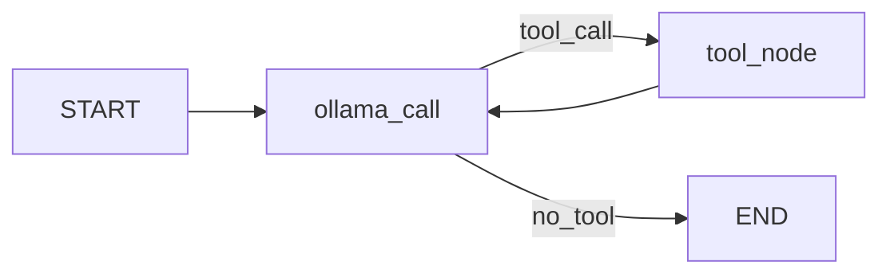

# Simple RAG - Sistema de Recuperação e Geração Aumentada

Sistema de RAG (Retrieval-Augmented Generation) que utiliza LangChain, Ollama e LangGraph para criar um agente
conversacional com acesso a documentos médicos.

## TL;DR

```shell
# python 3.13
poetry install
poetry run python -m simple_rag.core.vectorstore

poetry run python -m simple_rag.cli
```

## Descrição

Este projeto implementa um agente de IA que combina:

- **Retrieval**: Busca semântica em documentos usando embeddings
- **Generation**: Geração de respostas usando LLM (Llama 3.1)
- **Tools**: Ferramentas customizadas (calculadora e recuperação de documentos)

O agente atua como um assistente médico, respondendo perguntas com base em documentos de anamnese armazenados
localmente.

## Pré-requisitos

- **Python 3.13+** (requerido)
- Ollama instalado e rodando (com modelo `llama3.1:8b`)
- Servidor Ollama acessível (padrão: `http://localhost:11434`)

### Instalando Python 3.13

#### Linux (Ubuntu/Debian)

```bash
# Via deadsnakes PPA
sudo add-apt-repository ppa:deadsnakes/ppa
sudo apt update
sudo apt install python3.13 python3.13-venv python3.13-dev
```

#### macOS

```bash
# Via Homebrew
brew install python@3.13
```

#### Windows

1. Baixe o instalador em: https://www.python.org/downloads/
2. Execute o instalador e marque "Add Python to PATH"
3. Verifique a instalação: `python --version`

### Instalar Ollama

#### Linux

```bash
curl -fsSL https://ollama.com/install.sh | sh
```

Ou manualmente:

```bash
# Download do binário
curl -L https://ollama.com/download/ollama-linux-amd64 -o ollama
chmod +x ollama
sudo mv ollama /usr/local/bin/
```

#### Windows

1. Baixe o instalador do Ollama em: https://ollama.com/download/windows
2. Execute o arquivo `.exe` e siga o assistente de instalação
3. O Ollama será instalado e iniciado automaticamente como serviço

#### macOS

```bash
# Via Homebrew
brew install ollama

# Ou baixe o .dmg em: https://ollama.com/download/mac
```

### Configurar e Iniciar Ollama

Após a instalação, inicie o serviço Ollama:

```bash
# Linux/macOS
ollama serve

# Windows: O serviço inicia automaticamente. Para iniciar manualmente:
# Procure por "Ollama" no menu iniciar e execute
```

O Ollama por padrão roda em `http://localhost:11434`

### Baixar o Modelo

Após instalar, baixe o modelo necessário:

```bash
ollama pull llama3.1:8b ou llama3.2:3b
```

Verifique se o modelo foi baixado:

```bash
ollama list
```

## Instalação

### 1. Clone o repositório

```bash
git clone <url-do-repositorio>
cd processamento-linguagem-natural-puc-minas
```

### 2. Instale o Poetry

O Poetry é o gerenciador de dependências usado neste projeto.

#### Linux/macOS/Windows (WSL)

```bash
curl -sSL https://install.python-poetry.org | python3 -
```

#### Windows (PowerShell)

```powershell
(Invoke-WebRequest -Uri https://install.python-poetry.org -UseBasicParsing).Content | py -
```

Adicione o Poetry ao PATH conforme instruções exibidas após a instalação.

Verifique a instalação:

```bash
poetry --version
```

### 3. Configure o Poetry para usar Python 3.13

```bash
# Configure o Poetry para criar o ambiente virtual no diretório do projeto (opcional)
poetry config virtualenvs.in-project true

# Especifique o Python 3.13
poetry env use python3.13
```

### 4. Instale as dependências

```bash
# Instalar apenas dependências de produção
poetry install --without dev

# Ou instalar todas as dependências (incluindo desenvolvimento)
poetry install --with dev

# Nota: Com o formato PEP 621 atual, as dependências de desenvolvimento
# estão em [project.optional-dependencies] e podem ser instaladas com:
pip install -e ".[dev]"
```

### 5. Configure as variáveis de ambiente

```bash
# Copie o arquivo de exemplo
cp .env.example .env

# Edite o .env com suas configurações
# Especialmente OLLAMA_BASE_URL se não estiver usando localhost
```

Principais variáveis no `.env`:

```env
OLLAMA_BASE_URL=http://localhost:11434
OLLAMA_MODEL=llama3.1:8b
DATA_DIR=./data/anamnese
CHUNK_SIZE=1000
RETRIEVAL_K=4
LOG_LEVEL=INFO
```

## Estrutura do Projeto

```
processamento-linguagem-natural-puc-minas/
├── README.md
├── pyproject.toml            # Configuração Poetry e ferramentas
├── poetry.lock               # Lock file das dependências
├── requirements.txt          # (Mantido para compatibilidade)
├── .env.example              # Exemplo de configuração
├── .gitignore
│
├── docs/                     # Documentação
│   └── desenvolvimento.md    # Guia de desenvolvimento
│
├── data/
│   ├── README.md
│   └── anamnese/             # Documentos de anamnese
│       ├── camila-rodrigues-de-almeida.txt
│       ├── jose-carlos-da-silva.txt
│       └── maria-fernanda-oliveira-santos.txt
│
└── simple_rag/               # Pacote principal
    ├── __init__.py
    ├── config.py             # Configurações centralizadas
    ├── logger.py             # Sistema de logging
    ├── cli.py                # Interface CLI
    │
    ├── core/                 # Módulos principais
    │   ├── __init__.py
    │   ├── document_loader.py    # Carregamento de documentos
    │   ├── text_processor.py     # Divisão em chunks
    │   └── vectorstore.py        # Gestão do vector store
    │
    ├── agents/               # Agentes LangGraph
    │   ├── __init__.py
    │   └── medical_agent.py      # Agente médico principal
    │
    └── tools/                # Ferramentas para agentes
        ├── __init__.py
        ├── calculator.py         # add(), multiply()
        └── retriever.py          # retriever()
```

## Como Usar

### Executar a Aplicação (Modo Principal)

```bash
# Usando Poetry (recomendado)
poetry run python -m simple_rag.cli

# Ou ative o ambiente virtual do Poetry primeiro
poetry shell
python -m simple_rag.cli

# Ou use o comando direto (se configurado)
poetry run simple-rag
```

**Exemplo de interação:**

```
============================================================
Simple RAG - Assistente Médico
============================================================
Digite suas perguntas. Para sair, digite 'exit'

Você: Qual é o diagnóstico da paciente Camila?

Assistente: Com base nos documentos, a paciente Camila Rodrigues
de Almeida foi diagnosticada com lúpus eritematoso sistêmico...

Você: exit

Até logo!
```

### Testar Módulos Individuais

**Importante:** Use `poetry run` ou ative o ambiente virtual primeiro para garantir que as dependências corretas sejam
carregadas.

**Carregar e processar documentos:**

```bash
poetry run python -m simple_rag.core.document_loader
```

**Testar vector store:**

```bash
poetry run python -m simple_rag.core.vectorstore
```

**Testar agente:**

```bash
poetry run python -m simple_rag.agents.medical_agent
```

**Alternativa (ativando o shell primeiro):**

```bash
poetry shell
python -m simple_rag.core.document_loader
python -m simple_rag.core.vectorstore
python -m simple_rag.agents.medical_agent
```

## Funcionalidades

### Ferramentas Disponíveis

O agente possui três ferramentas:

1. **add(a, b)**: Soma dois números inteiros
2. **multiply(a, b)**: Multiplica dois números inteiros
3. **retriever(query)**: Busca documentos relevantes no vector store usando similaridade semântica

### Fluxo do Agente



1. **ollama_call**: LLM analisa a mensagem e decide se precisa chamar uma ferramenta
2. **tool_node**: Executa a ferramenta solicitada
3. Loop continua até o LLM decidir responder diretamente ao usuário

## Configuração

### Configurar via .env

Todas as configurações estão centralizadas no arquivo `.env`:

```env
# Ollama Configuration
OLLAMA_BASE_URL=http://localhost:11434
OLLAMA_MODEL=llama3.1:8b
OLLAMA_TEMPERATURE=0

# Embedding Configuration
EMBEDDING_MODEL=sentence-transformers/all-MiniLM-L6-v2

# Document Processing
DATA_DIR=./data/anamnese
CHUNK_SIZE=1000
CHUNK_OVERLAP=200

# Retrieval
RETRIEVAL_K=4
RETRIEVAL_TYPE=similarity

# Logging
LOG_LEVEL=INFO
LOG_FILE=./logs/app.log
```

### Cenários Comuns de Configuração

**Ollama rodando localmente (mesma máquina):**

```env
OLLAMA_BASE_URL=http://localhost:11434
```

**Ollama rodando em outra máquina na rede:**

```env
OLLAMA_BASE_URL=http://192.168.1.100:11434
```

**Ollama rodando em container Docker:**

```env
OLLAMA_BASE_URL=http://host.docker.internal:11434  # Windows/Mac
# ou
OLLAMA_BASE_URL=http://172.17.0.1:11434  # Linux
```

**Testar conexão com Ollama:**

```bash
curl http://localhost:11434/api/version
```

### Modelos Alternativos

Edite o `.env` para usar outro modelo:

```env
OLLAMA_MODEL=llama3.2:3b  # Modelo menor e mais rápido
# ou
OLLAMA_MODEL=mistral:7b   # Alternativa do Mistral AI
# ou
OLLAMA_MODEL=gemma2:9b    # Modelo do Google
```

Certifique-se de baixar o modelo antes:

```bash
ollama pull <nome-do-modelo>
```

### Modificar o Comportamento do Agente

Edite o `SystemMessage` em `simple_rag/agents/medical_agent.py`:

```python
SystemMessage(
    content="Você é um assistente médico especializado em anamnese..."
)
```

### Ajustar Parâmetros de Busca

Edite o `.env`:

```env
RETRIEVAL_K=4              # Número de documentos retornados
RETRIEVAL_TYPE=similarity  # Tipo de busca
```

### Modificar Chunking dos Documentos

Edite o `.env`:

```env
CHUNK_SIZE=1000      # Tamanho dos chunks
CHUNK_OVERLAP=200    # Overlap entre chunks
```

## Adicionando Novos Documentos

1. Coloque arquivos `.txt` no diretório `data/anamnese/`
2. Use encoding UTF-8
3. Os documentos serão carregados automaticamente na próxima execução

**Nota**: O projeto atualmente suporta apenas arquivos `.txt` com encoding UTF-8.

## Troubleshooting

### Erro: ImportError ou problemas com dependências

Se você encontrar erros como `ImportError: cannot import name '_imaging' from 'PIL'` ou
`Could not import sentence_transformers`, certifique-se de usar o ambiente virtual do Poetry:

```bash
# SEMPRE use poetry run ou ative o shell do Poetry
poetry run python -m simple_rag.cli

# Ou ative o shell primeiro
poetry shell
python -m simple_rag.cli
```

**Problema:** Executar `python -m simple_rag.cli` diretamente pode usar o Python do sistema ao invés do ambiente
virtual, causando conflitos de dependências.

**Solução:** Use `poetry run` ou ative o shell com `poetry shell` primeiro.

### Erro: ModuleNotFoundError

```bash
# Execute a partir do diretório raiz
cd processamento-linguagem-natural-puc-minas
poetry run python -m simple_rag.cli
```

### Erro de conexão com Ollama

Verifique se:

1. O servidor Ollama está rodando: `ollama serve`
2. O endereço está correto no `.env`
3. O modelo está baixado: `ollama list`

```bash
# Verificar se Ollama está rodando
curl http://localhost:11434/api/version

# Iniciar se necessário
ollama serve
```

### Modelo não encontrado

```bash
# Listar modelos instalados
ollama list

# Baixar modelo
ollama pull llama3.1:8b
```

### Diretório de dados não encontrado

Verifique o `.env`:

```env
DATA_DIR=./data/anamnese  # Caminho correto
```

### Validar Configuração

```python
from simple_rag.config import config

try:
    config.validate()
    print("✓ Configuração válida!")
except ValueError as e:
    print(f"✗ Erro: {e}")
```

## Logging

O sistema usa logs em dois níveis:

- **Console**: INFO e acima (formatação simples)
- **Arquivo**: DEBUG e acima (formatação detalhada com timestamps)

Para ajustar o nível de log, edite o `.env`:

```env
LOG_LEVEL=DEBUG  # Mais verboso
LOG_LEVEL=INFO   # Padrão
LOG_LEVEL=WARNING  # Apenas avisos e erros
```

## Dependências Principais

- **langchain** - Framework principal para LLM
- **langchain-ollama** - Interface com modelos Ollama
- **langgraph** - Orquestração de grafos de agentes
- **langchain-huggingface** - Embeddings
- **sentence-transformers** - Modelos de embedding pré-treinados
- **langchain-community** - Loaders de documentos
- **python-dotenv** - Gerenciamento de variáveis de ambiente

## Documentação Adicional

- **[MIGRAÇÃO_COMPLETA.md](./MIGRAÇÃO_COMPLETA.md)** - Resumo da reorganização do projeto
- **[PROPOSTA.md](./PROPOSTA.md)** - Proposta detalhada de reorganização com código
- **[ESTRUTURA_SUGERIDA.md](./ESTRUTURA_SUGERIDA.md)** - Estrutura avançada para produção
- **[docs/desenvolvimento.md](./docs/desenvolvimento.md)** - Guia completo de desenvolvimento
- **[data/README.md](./data/README.md)** - Estrutura e formato dos dados

## Desenvolvimento

Este projeto utiliza **Python 3.13** e aproveita suas novas funcionalidades:

### Recursos do Python 3.13 utilizados

- **Better error messages** - Mensagens de erro mais claras e precisas
- **Improved typing** - Melhor suporte para type hints
- **Performance improvements** - ~15% mais rápido que Python 3.12
- **New REPL** - Interface interativa melhorada

### Ferramentas de desenvolvimento

Para desenvolvimento, instale as dependências adicionais:

```bash
# Usando Poetry - instalar todas as dependências incluindo dev
poetry install --with dev

# Ou usando pip com dependências opcionais
pip install -e ".[dev]"
```

Ferramentas incluídas:

- `pytest` - Testes automatizados
- `black` - Formatação de código (configurado para Python 3.13)
- `ruff` - Linting ultra-rápido (target: py313)
- `mypy` - Type checking (python_version = 3.13)
- `pydocstring` - Validação de docstrings

### Git Hooks

O projeto possui um pre-commit hook que executa automaticamente:

1. **Black** - Formatação de código
2. **Ruff** - Linting e correções automáticas
3. **Mypy** - Type checking
4. **Pydocstring** - Validação de docstrings

O hook é executado automaticamente antes de cada commit.

Consulte [docs/desenvolvimento.md](./docs/desenvolvimento.md) para mais detalhes.

## Comandos Úteis

### Gerenciamento de Dependências com Poetry

```bash
# Adicionar nova dependência de produção
poetry add <package>

# Adicionar dependência de desenvolvimento
poetry add --group dev <package>

# Atualizar dependências
poetry update

# Ver dependências instaladas
poetry show

# Ver dependências desatualizadas
poetry show --outdated

# Remover dependência
poetry remove <package>
```

### Executar Aplicação

```bash
# Executar aplicação
poetry run python -m simple_rag.cli

# Ou ativar ambiente virtual primeiro
poetry shell
python -m simple_rag.cli

# Testar módulos individuais
poetry run python -m simple_rag.core.vectorstore
poetry run python -m simple_rag.agents.medical_agent

# Verificar configuração
poetry run python -c "from simple_rag.config import config; print(f'Modelo: {config.OLLAMA_MODEL}')"
```

### Ferramentas de Desenvolvimento

```bash
# Formatar código
poetry run black simple_rag/

# Linting
poetry run ruff check simple_rag/

# Linting com auto-fix
poetry run ruff check --fix simple_rag/

# Type checking
poetry run mypy simple_rag/

# Executar testes
poetry run pytest

# Executar testes com coverage
poetry run coverage run -m pytest
poetry run coverage report
```

## Licença

[Especifique a licença do projeto]

## Contribuição

[Instruções para contribuição, se aplicável]
