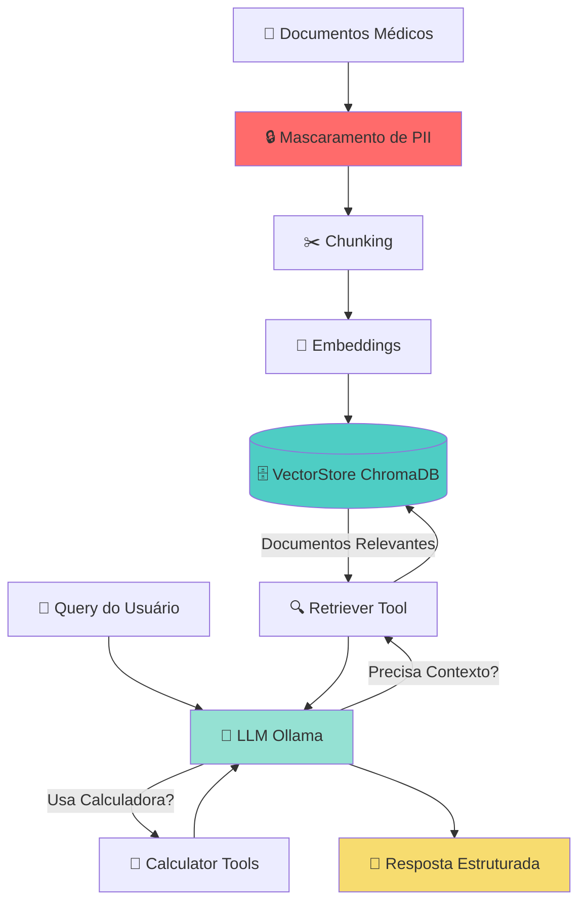

# Simple RAG - Sistema de Recuperação e Geração Aumentada

Sistema de RAG (Retrieval-Augmented Generation) que utiliza LangChain, Ollama e LangGraph para criar um agente
conversacional com acesso seguro a documentos médicos, incluindo mascaramento automático de dados pessoais.

[](https://www.python.org/downloads/)
[](https://python-poetry.org/)
[](LICENSE)

---

## 📚 Documentação

- **[docs/](./docs/)** - Documentação completa e detalhada
    - [Arquitetura do Sistema](./docs/arquitetura.md)
    - [Guia do Notebook](./docs/notebook.md)
    - [Mascaramento de Dados](./docs/mascaramento-guia-rapido.md)
- **[examples/](./examples/)** - Exemplos práticos de uso

---

## 🚀 Início Rápido

### TL;DR

```bash
# Instalar dependências
poetry install

# Iniciar aplicação
poetry run python -m simple_rag.main
```

### Pré-requisitos

- **Python 3.13+**
- **Ollama** com modelo `llama3.1:8b` ou `llama3.2:3b`
- **Poetry** (gerenciador de dependências)

---

## 💡 O que é este projeto?

Este sistema implementa um agente de IA para análise de documentos médicos com:

🔍 **Retrieval (Busca):** Busca semântica inteligente usando embeddings
🤖 **Generation (Geração):** Respostas contextualizadas via LLM (Llama 3.1)
🔒 **Mascaramento de PII:** Proteção automática de dados pessoais sensíveis
🛠️ **Tools:** Ferramentas customizadas (calculadora, recuperação de documentos)

---

## 🏗️ Arquitetura


```mermaid
flowchart TD
    A[📄 Documentos Médicos] --> B[🔒 Mascaramento de PII]
B --> C[✂️ Chunking]
C --> D[🧮 Embeddings]
D --> E[(🗄️ VectorStore ChromaDB)]

F[👤 Query do Usuário] --> G[🤖 LLM Ollama]
G -->|Precisa Contexto?|H[🔍 Retriever Tool]
H --> E
E -->|Documentos Relevantes|H
H --> G
G -->|Usa Calculadora?| I[🔢 Calculator Tools]
I --> G
G --> J[💬 Resposta Estruturada]

style B fill: #ff6b6b
style E fill: #4ecdc4
style G fill: #95e1d3
style J fill: #f7dc6f
```

### Fluxo de Processamento

**1. Indexação (Offline):**

- 📄 Documentos são carregados do diretório `data/anamnese/`
- 🔒 Dados sensíveis são mascarados (Nome, CPF, RG, etc.)
- ✂️ Textos são divididos em chunks
- 🧮 Embeddings são gerados
- 🗄️ Chunks armazenados no ChromaDB

**2. Consulta (Online):**

- 👤 Usuário faz uma pergunta
- 🤖 LLM analisa e decide quais ferramentas usar
- 🔍 Retriever busca documentos relevantes
- 💬 LLM gera resposta estruturada

📖 **[Veja arquitetura detalhada →](./docs/arquitetura.md)**

---

## 📦 Instalação

### 1. Instalar Python 3.13

<details>
<summary><b>Linux (Ubuntu/Debian)</b></summary>

```bash
sudo add-apt-repository ppa:deadsnakes/ppa
sudo apt update
sudo apt install python3.13 python3.13-venv python3.13-dev
```

</details>

<details>
<summary><b>macOS</b></summary>

```bash
brew install python@3.13
```

</details>

<details>
<summary><b>Windows</b></summary>

Baixe o instalador em [python.org/downloads](https://www.python.org/downloads/)
</details>

### 2. Instalar Ollama

<details>
<summary><b>Linux</b></summary>

```bash
curl -fsSL https://ollama.com/install.sh | sh
ollama serve
ollama pull llama3.1:8b
```

</details>

<details>
<summary><b>Windows/macOS</b></summary>

Baixe o instalador em [ollama.com](https://ollama.com/download)

Após instalar:

```bash
ollama pull llama3.1:8b
```

</details>

### 3. Instalar Dependências do Projeto

```bash
# Clonar repositório
git clone <url-do-repositorio>
cd processamento-linguagem-natural-puc-minas

# Instalar Poetry
curl -sSL https://install.python-poetry.org | python3 -

# Configurar e instalar dependências
poetry config virtualenvs.in-project true
poetry env use python3.13
poetry install
```

### 4. Configurar Variáveis de Ambiente

```bash
# Copiar arquivo de exemplo
cp .env.example .env

# Editar configurações
nano .env
```

**.env exemplo:**

```env
OLLAMA_BASE_URL=http://localhost:11434
OLLAMA_MODEL=llama3.1:8b
DATA_DIR=./data/anamnese
RETRIEVAL_K=4
LOG_LEVEL=INFO
```

---

## 🎮 Como Usar

### Executar Aplicação Principal

```bash
# Usando Poetry
poetry run python -m simple_rag.main

# Ou ativando o shell primeiro
poetry shell
python -m simple_rag.main
```

**Exemplo de interação:**

```
============================================================
Simple RAG - Assistente Médico
============================================================

Você: Qual é o diagnóstico do paciente João Gabriel?

Assistente: Com base nos documentos, o paciente João Gabriel,
72 anos, foi diagnosticado com hematúria (sangue na urina)...

Você: exit
Até logo!
```

### Testar Módulos Individuais

```bash
# Testar vectorstore
poetry run python -m simple_rag.utils.vectorstore

# Testar agente
poetry run python -m simple_rag.agent.agent

# Testar mascaramento
poetry run python -m simple_rag.utils.test_data_masking
```

### Usar Jupyter Notebook

```bash
jupyter notebook rag.ipynb
```

📖 **[Guia completo do notebook →](./docs/notebook.md)**

---

## 🔒 Mascaramento de Dados Pessoais

O sistema inclui proteção automática de dados sensíveis:

| Tipo           | Exemplo Original      | Exemplo Mascarado     |
|----------------|-----------------------|-----------------------|
| **Nome**       | `Nome: João da Silva` | `Nome: J*** da S****` |
| **Data Nasc.** | `15/03/1953`          | `**/**/****`          |
| **CPF**        | `123.456.789-00`      | `123.***.***-00`      |
| **RG**         | `12.345.678-9`        | `12.***.***-9`        |
| **Email**      | `user@email.com`      | `user@email.com`      |
| **Telefone**   | `(11) 98765-4321`     | `(**) *****-4321`     |

### Uso Rápido

```python
from simple_rag.utils import mask_all_pii

# Mascarar todos os dados pessoais
text = """
Nome: João Silva
CPF: 123.456.789-00
Email: joao@hospital.com
"""

masked = mask_all_pii(text)
print(masked)
```

📖 **[Guia completo de mascaramento →](./docs/mascaramento-guia-rapido.md)**

---

## ⚙️ Configuração

### Cenários Comuns

**Ollama Local:**

```env
OLLAMA_BASE_URL=http://localhost:11434
```

**Ollama em Rede:**

```env
OLLAMA_BASE_URL=http://192.168.1.100:11434
```

**Modelo Alternativo:**

```env
OLLAMA_MODEL=llama3.2:3b  # Mais rápido
OLLAMA_MODEL=mistral:7b   # Alternativa
```

### Adicionar Documentos

1. Coloque arquivos `.txt` em `data/anamnese/`
2. Use encoding UTF-8
3. Execute a aplicação (indexação automática)

---

## 📁 Estrutura do Projeto

```
processamento-linguagem-natural-puc-minas/
├── README.md                         # Este arquivo
├── pyproject.toml                    # Dependências e configuração
├── .env                              # Variáveis de ambiente
│
├── docs/                             # 📚 Documentação completa
│   ├── README.md                     # Índice da documentação
│   ├── arquitetura.md                # Arquitetura detalhada
│   ├── notebook.md                   # Guia do Jupyter Notebook
│   └── mascaramento-*.md             # Docs de mascaramento
│
├── examples/                         # 💡 Exemplos práticos
│   ├── demo_final_masking.py         # Demo completa
│   └── mask_anamnese_example.py      # Exemplo com arquivos
│
├── data/anamnese/                    # 📄 Documentos de entrada
│
├── simple_rag/                       # 🔧 Código fonte
│   ├── main.py                       # CLI principal
│   ├── agent/                        # Agente LangGraph
│   ├── tools/                        # Ferramentas (retriever, calculator)
│   ├── config/                       # Configurações
│   └── utils/                        # Utilitários (logger, vectorstore, masking)
│
├── rag.ipynb                         # 📓 Notebook de demonstração
└── chromadb/                         # 🗄️ Dados persistentes
```

---

## 🧪 Ferramentas Disponíveis

O agente possui as seguintes ferramentas:

1. **`retriever(query)`** - Busca documentos relevantes no VectorStore
2. **`add(a, b)`** - Soma dois números
3. **`multiply(a, b)`** - Multiplica dois números

---

## 🐛 Troubleshooting

### Erro: ModuleNotFoundError

```bash
# Execute a partir do diretório raiz
cd processamento-linguagem-natural-puc-minas
poetry run python -m simple_rag.main
```

### Erro de conexão com Ollama

```bash
# Verificar se Ollama está rodando
curl http://localhost:11434/api/version

# Iniciar Ollama
ollama serve
```

### Modelo não encontrado

```bash
# Listar modelos instalados
ollama list

# Baixar modelo
ollama pull llama3.1:8b
```

📖 **[Troubleshooting completo →](./docs/arquitetura.md#troubleshooting)**

---

## 🛠️ Desenvolvimento

### Instalar Dependências de Desenvolvimento

```bash
poetry install --with dev
```

### Ferramentas Incluídas

- `pytest` - Testes automatizados
- `black` - Formatação de código
- `ruff` - Linting
- `mypy` - Type checking

### Comandos Úteis

```bash
# Formatar código
poetry run black simple_rag/

# Linting
poetry run ruff check simple_rag/

# Type checking
poetry run mypy simple_rag/

# Executar testes
poetry run pytest
```

---

## 📚 Documentação Adicional

### Documentação Técnica

- **[Arquitetura do Sistema](./docs/arquitetura.md)** - Componentes, fluxo, conceitos técnicos
- **[Guia do Notebook](./docs/notebook.md)** - Explicação célula por célula
- **[Mascaramento de Dados](./docs/mascaramento-guia-rapido.md)** - Proteção de PII

### Guias Práticos

- **[Docker README](./DOCKER_README.md)** - Execução com Docker
- **[Exemplos](./examples/)** - Scripts de demonstração

### Recursos Externos

- [LangChain Documentation](https://python.langchain.com/)
- [Ollama Documentation](https://ollama.com/docs)
- [ChromaDB Documentation](https://docs.trychroma.com/)

---

## 📊 Dependências Principais

- **langchain** - Framework para LLM
- **langchain-ollama** - Interface com Ollama
- **langgraph** - Orquestração de agentes
- **langchain-huggingface** - Embeddings
- **chromadb** - Vector database
- **python-dotenv** - Gerenciamento de .env

---
