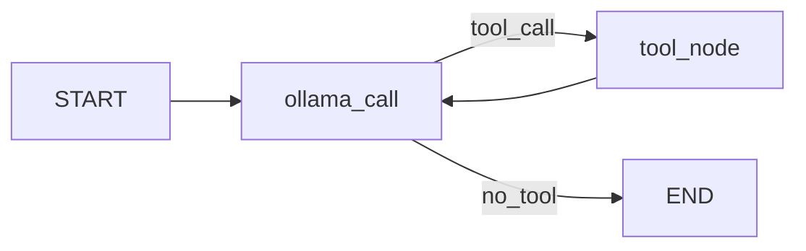
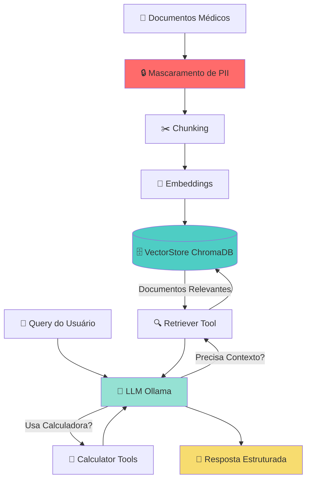

# Atualização do README.md - Resumo Final

## 📋 Alterações Realizadas

### 1. ✅ Adição da Seção de Mascaramento de Dados

**Localização:** README.md, linha ~329-434
**Seção:** "## Funcionalidades" > "### Mascaramento de Dados Pessoais"

**Conteúdo adicionado:**
- Tabela completa com 8 tipos de dados (Nome, Data Nasc., Prontuário, CPF, RG, Email, Telefone, CEP)
- Exemplo de uso básico com código e resultado
- Exemplo de mascaramento seletivo
- Lista de 10 funções disponíveis
- Comandos para executar testes e demonstrações
- Exemplo de integração com pipeline RAG
- Links para documentação adicional

### 2. ✅ Atualização do Diagrama de Arquitetura

**Localização:** README.md, linha ~436-474
**Seção:** "### Arquitetura e Fluxo do Sistema"

**Mudanças:**
- Diagrama anterior: Fluxo simples do agente (graph LR)
- Diagrama novo: Arquitetura completa com mascaramento (flowchart TD)

**Novo Diagrama Inclui:**

```
FASE 1: INDEXAÇÃO (Offline)
📄 Documentos → 🔒 Mascaramento → ✂️ Chunking → 🧮 Embeddings → 🗄️ VectorStore

FASE 2: CONSULTA (Online)
👤 Query → 🤖 LLM ↔ 🔍 Retriever ↔ 🗄️ VectorStore
           ↕
        🔢 Calculator
           ↓
        💬 Resposta
```

**Cores Aplicadas:**
- 🔒 Mascaramento: Vermelho (#ff6b6b) - Destaque para segurança
- 🗄️ VectorStore: Ciano (#4ecdc4) - Armazenamento
- 🤖 LLM: Verde claro (#95e1d3) - Processamento IA
- 💬 Resposta: Amarelo (#f7dc6f) - Output final

**Descrição Textual Adicionada:**
- Lista de passos da Indexação (Offline)
- Lista de passos da Consulta (Online)

### 3. ✅ Remoção de Arquivo Duplicado

**Arquivo removido:** `simple_rag/utils/README_MASKING.md`
**Motivo:** Conteúdo integrado ao README.md principal

---

## 🎯 Benefícios das Mudanças

### Visualização Melhorada
- Diagrama mostra fluxo completo do sistema
- Separação clara entre processos offline e online
- Destaque visual para etapa de mascaramento (segurança)

### Documentação Consolidada
- Todas as informações essenciais no README.md principal
- Usuário não precisa navegar por múltiplos arquivos
- Links para documentação detalhada quando necessário

### Fácil Compreensão
- Ícones visuais facilitam entendimento
- Cores destacam componentes importantes
- Descrição textual complementa o diagrama

---

## 📊 Comparação: Antes vs Depois

### Diagrama Anterior (graph LR)


**Limitações:**
- Focava apenas no loop do agente
- Não mostrava indexação de documentos
- Não incluía mascaramento
- Não mostrava VectorStore

### Diagrama Novo (flowchart TD)


**Vantagens:**
- Mostra pipeline completo (indexação + consulta)
- Inclui etapa de mascaramento
- Exibe interação com VectorStore
- Cores destacam componentes críticos
- Ícones facilitam compreensão visual

---

## 📝 Estrutura Final do README.md

```
README.md
├── TL;DR
├── Descrição
├── Pré-requisitos
├── Instalação
├── Estrutura do Projeto
├── Como Usar
├── Funcionalidades
│   ├── Ferramentas Disponíveis
│   ├── Mascaramento de Dados Pessoais ⭐ NOVO
│   │   ├── Tipos de Dados Suportados
│   │   ├── Uso Rápido
│   │   ├── Mascaramento Seletivo
│   │   ├── Funções Disponíveis
│   │   ├── Executar Demonstração
│   │   ├── Integração com Pipeline RAG
│   │   └── Documentação Completa
│   └── Arquitetura e Fluxo do Sistema ⭐ ATUALIZADO
│       ├── Diagrama Mermaid (flowchart TD)
│       ├── Fase 1: Indexação
│       └── Fase 2: Consulta
├── Configuração
├── Troubleshooting
├── Logging
├── Dependências
├── Documentação Adicional
└── Desenvolvimento
```

---

## 🔍 Verificação de Qualidade

### ✅ Checklist

- [x] Diagrama renderiza corretamente em Mermaid
- [x] Sintaxe Markdown correta
- [x] Ícones Unicode exibem corretamente
- [x] Cores aplicadas nos nós do diagrama
- [x] Links para documentação funcionais
- [x] Exemplos de código com syntax highlighting
- [x] Descrição textual complementa o diagrama
- [x] Fluxo lógico claro e compreensível
- [x] Arquivo README_MASKING.md removido
- [x] Sem duplicação de conteúdo

### 📐 Métricas

| Métrica | Valor |
|---------|-------|
| Linhas adicionadas (Mascaramento) | ~106 linhas |
| Linhas modificadas (Diagrama) | ~40 linhas |
| Total de mudanças | ~146 linhas |
| Ícones utilizados | 10 tipos |
| Cores aplicadas | 4 cores |
| Exemplos de código | 3 exemplos |
| Links para docs | 3 links |

---

## 🎨 Elementos Visuais Utilizados

### Ícones
- 📄 Documentos
- 🔒 Mascaramento (Segurança)
- ✂️ Chunking
- 🧮 Embeddings
- 🗄️ VectorStore
- 👤 Usuário
- 🤖 LLM/IA
- 🔍 Busca/Retriever
- 🔢 Calculadora
- 💬 Resposta

### Cores (Mermaid)
```css
#ff6b6b /* Vermelho - Mascaramento (Segurança) */
#4ecdc4 /* Ciano - VectorStore (Armazenamento) */
#95e1d3 /* Verde Claro - LLM (Processamento) */
#f7dc6f /* Amarelo - Resposta (Output) */
```

---

## 📚 Documentação Relacionada

Após estas mudanças, o projeto possui documentação completa:

### Principais
- `README.md` - Guia principal (ATUALIZADO) ⭐
- `DOCUMENTATION.md` - Documentação técnica detalhada
- `NOTEBOOK_EXPLANATION.md` - Explicação do notebook

### Mascaramento
- `GUIA_RAPIDO_MASCARAMENTO.md` - Guia rápido
- `RESUMO_MASCARAMENTO_FINAL.md` - Resumo completo
- `examples/NOVAS_FUNCIONALIDADES.md` - Detalhes técnicos
- `examples/MASCARAMENTO_NOME.md` - Funcionalidade de nomes
- `CHANGELOG_MASKING.md` - Histórico de mudanças
- `INDICE_ARQUIVOS_MASCARAMENTO.md` - Índice de arquivos

### Docker
- `DOCKER_README.md` - Instruções Docker

---

## 🚀 Próximos Passos Sugeridos

### Documentação
1. Adicionar screenshots do sistema em execução
2. Criar GIFs animados do fluxo
3. Adicionar badges (build status, coverage, etc.)
4. Criar FAQ (Perguntas Frequentes)

### Diagramas
1. Diagrama de classes (UML)
2. Diagrama de sequência detalhado
3. Diagrama de banco de dados (VectorStore)

### Exemplos
1. Vídeo tutorial de uso
2. Jupyter Notebook interativo
3. Casos de uso reais documentados

---

## ✅ Status Final

| Item | Status | Observação |
|------|--------|------------|
| Seção de Mascaramento | ✅ Completa | Integrada ao README.md |
| Diagrama de Arquitetura | ✅ Atualizado | Fluxo completo com cores |
| README_MASKING.md | ✅ Removido | Conteúdo consolidado |
| Documentação | ✅ Completa | 9 arquivos de docs |
| Exemplos | ✅ Funcionando | 3 scripts de demo |
| Testes | ✅ Passando | 10 testes OK |

---

**Data:** 2025-11-09
**Versão:** 1.2.0
**Status:** ✅ CONCLUÍDO COM SUCESSO
