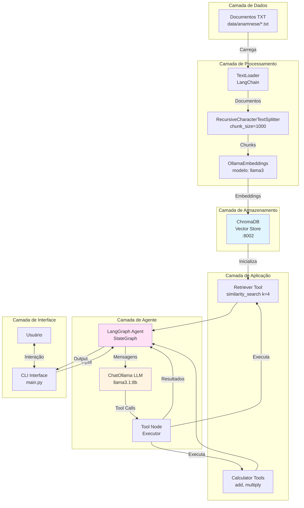
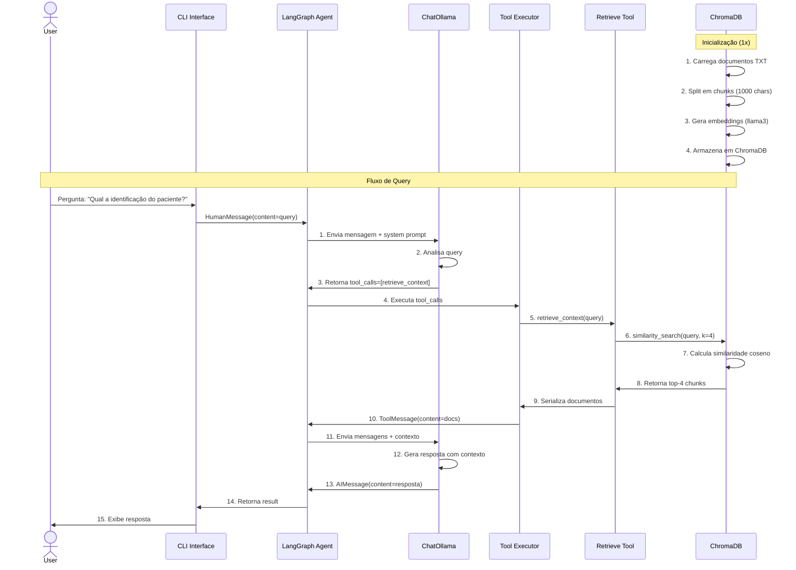
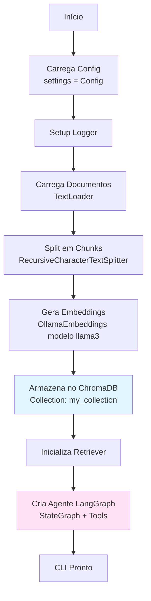
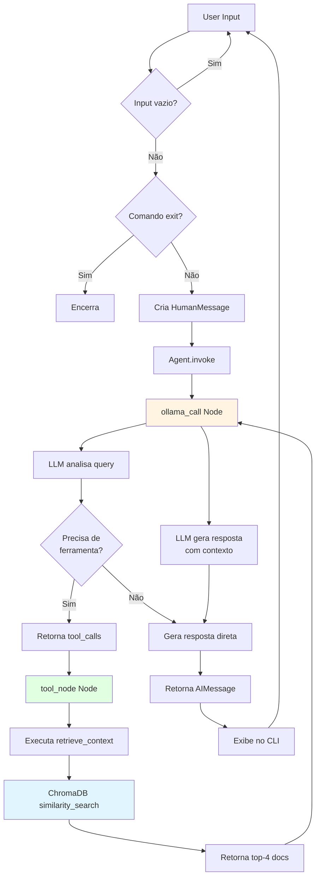
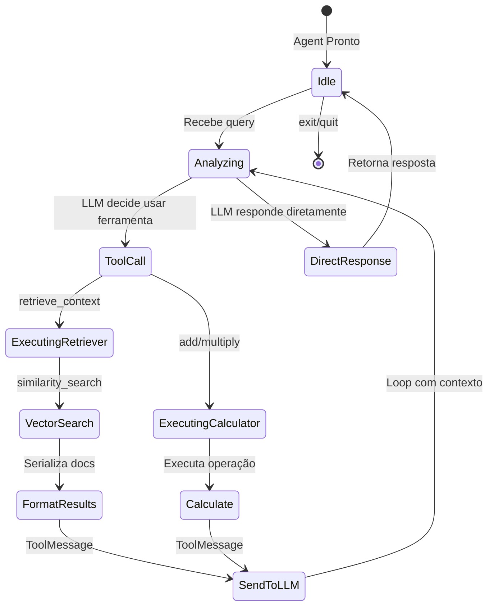

# Simple RAG - Documentação Completa

## Índice
1. [Visão Geral](#visão-geral)
2. [Arquitetura do Sistema](#arquitetura-do-sistema)
3. [Componentes Principais](#componentes-principais)
4. [Fluxo de Execução](#fluxo-de-execução)
5. [Estrutura do Projeto](#estrutura-do-projeto)
6. [Tecnologias Utilizadas](#tecnologias-utilizadas)

---

## Visão Geral

O **Simple RAG** é um sistema de Retrieval-Augmented Generation (RAG) desenvolvido para responder perguntas sobre documentos médicos de anamnese. O sistema combina:

- **LangChain**: Framework para desenvolvimento de aplicações com LLMs
- **Ollama**: Servidor local de modelos de linguagem (LLaMA 3.1)
- **ChromaDB**: Banco de dados vetorial para armazenamento de embeddings
- **LangGraph**: Orquestração de agentes com fluxo de controle

### Objetivo

Permitir que usuários façam perguntas sobre dados médicos privados (anamneses) de forma conversacional, com o sistema recuperando informações relevantes e gerando respostas contextualizadas.

---

## Arquitetura do Sistema

### Diagrama de Arquitetura



### Componentes por Camada

#### 1. Camada de Dados
- **Arquivos TXT**: Documentos de anamnese médica armazenados em `data/anamnese/`
- Formato: Texto plano estruturado com seções (Identificação, Queixa Principal, etc.)

#### 2. Camada de Processamento
- **TextLoader**: Carrega arquivos `.txt` do diretório
- **RecursiveCharacterTextSplitter**: Divide documentos em chunks de 1000 caracteres com overlap de 200
- **OllamaEmbeddings**: Gera embeddings vetoriais usando o modelo llama3 (4096 dimensões)

#### 3. Camada de Armazenamento
- **ChromaDB**: Banco de dados vetorial persistente
- **Collection**: `my_collection`
- **Port**: 8002 (configurável)

#### 4. Camada de Aplicação
- **retrieve_context**: Ferramenta de busca por similaridade (retorna top-4 documentos)
- **add/multiply**: Ferramentas auxiliares de cálculo

#### 5. Camada de Agente
- **ChatOllama**: Interface com LLM llama3.1:8b
- **LangGraph Agent**: Grafo de estados que controla o fluxo conversacional
- **Tool Node**: Executor de ferramentas chamadas pelo LLM

#### 6. Camada de Interface
- **CLI**: Interface de linha de comando interativa
- Loop de input/output com tratamento de erros

---

## Componentes Principais

### 1. Configuração (`simple_rag/config/config.py`)

Sistema de configuração baseado em Pydantic com validação automática:

```python
class Config(BaseSettings):
    # Ollama
    ollama_base_url: str = "http://11.7.0.2:11434"
    ollama_model: str = "llama3.1:8b"
    ollama_temperature: float = 0.0

    # Embeddings
    embedding_model: str = "llama3"

    # Processamento
    chunk_size: int = 1000
    chunk_overlap: int = 200

    # Retrieval
    retrieval_k: int = 5
```

**Principais configurações:**
- Modelo LLM: LLaMA 3.1 8B (via Ollama)
- Temperatura: 0.0 (respostas determinísticas)
- Chunks: 1000 caracteres com overlap de 200
- Retrieval: Top-5 documentos por similaridade

### 2. Vector Store (`simple_rag/utils/vectorstore.py`)

Gerencia o ciclo de vida do banco de dados vetorial:

**Funções principais:**
- `_load_documents()`: Carrega arquivos `.txt` do diretório de dados
- `_split_documents()`: Divide em chunks usando RecursiveCharacterTextSplitter
- `get_ollama_embedding_function()`: Inicializa modelo de embeddings
- `get_vectorstore()`: Retorna instância do ChromaDB com dados carregados

**Fluxo:**
```
Documentos → TextLoader → Splitter → Embeddings → ChromaDB
```

### 3. Retriever Tool (`simple_rag/tools/retriever.py`)

Ferramenta LangChain que busca documentos relevantes:

```python
@tool(response_format="content_and_artifact")
def retrieve_context(query: str):
    """Busca informações privadas no vectorstore."""
    retrieved_docs = vectorstore.similarity_search(query, k=4)
    serialized = "\n\n".join(
        f"Source: {doc.metadata}\nContent: {doc.page_content}"
        for doc in retrieved_docs
    )
    return serialized, retrieved_docs
```

**Características:**
- Busca por similaridade semântica
- Retorna top-4 documentos mais relevantes
- Formato: Conteúdo + Metadados

### 4. Agente LangGraph (`simple_rag/agent/agent.py`)

Orquestrador principal usando grafo de estados:

**Estados:**
```python
class MessagesState(TypedDict):
    messages: list[AnyMessage]  # Histórico de mensagens
    llm_calls: int              # Contador de chamadas
```

**Nós do Grafo:**
1. `ollama_call`: LLM decide se chama ferramenta ou responde
2. `tool_node`: Executa ferramentas solicitadas
3. `should_continue`: Controle condicional de fluxo

**Fluxo do Grafo:**
```
START → ollama_call → [tool_node → ollama_call]* → END
```

### 5. CLI (`simple_rag/main.py`)

Interface de linha de comando interativa:

**Funcionalidades:**
- Loop conversacional contínuo
- Tratamento de exceções
- Logging estruturado
- Comandos: `exit`, `quit`, `sair`

---

## Fluxo de Execução

### Diagrama de Fluxo Completo



### Fluxo Detalhado por Fase

#### Fase 1: Inicialização (Startup)



**Tempo estimado:** 5-30 segundos (dependendo do volume de dados)

#### Fase 2: Processamento de Query



#### Fase 3: Execução de Ferramentas



---

## Estrutura do Projeto

```
processamento-linguagem-natural-puc-minas/
│
├── data/
│   ├── anamnese/                      # Documentos de entrada
│   │   ├── anamnese1.txt             # Caso clínico J.G.
│   │   └── ...
│   └── old/                          # Arquivos antigos
│
├── simple_rag/                        # Pacote principal
│   ├── __init__.py
│   ├── main.py                       # CLI e ponto de entrada
│   │
│   ├── config/                       # Configurações
│   │   ├── __init__.py
│   │   └── config.py                # Settings com Pydantic
│   │
│   ├── agent/                        # Agente LangGraph
│   │   ├── __init__.py
│   │   └── agent.py                 # StateGraph + Nós
│   │
│   ├── tools/                        # Ferramentas LangChain
│   │   ├── __init__.py
│   │   ├── retriever.py            # retrieve_context tool
│   │   └── calculator.py           # add/multiply tools
│   │
│   └── utils/                        # Utilitários
│       ├── __init__.py
│       ├── logger.py                # Setup de logging
│       └── vectorstore.py           # Gerenciamento ChromaDB
│
├── chromadb/                         # Dados persistentes ChromaDB
│
├── rag.ipynb                         # Notebook de demonstração
│
├── pyproject.toml                    # Dependências e config
├── requirements.txt                  # Dependências pip
├── docker-compose.yml                # Configuração Docker
├── Dockerfile                        # Build da aplicação
└── .env                             # Variáveis de ambiente
```

### Descrição dos Diretórios

| Diretório | Propósito |
|-----------|-----------|
| `data/anamnese/` | Armazena documentos TXT de entrada (anamneses médicas) |
| `simple_rag/config/` | Gerenciamento centralizado de configurações |
| `simple_rag/agent/` | Lógica do agente conversacional (LangGraph) |
| `simple_rag/tools/` | Ferramentas LangChain (retriever, calculadora) |
| `simple_rag/utils/` | Utilitários (logging, vectorstore) |
| `chromadb/` | Persistência do banco de dados vetorial |

---

## Tecnologias Utilizadas

### Core

| Tecnologia | Versão | Propósito |
|------------|--------|-----------|
| **Python** | 3.13 | Linguagem principal |
| **LangChain** | Latest | Framework RAG |
| **LangGraph** | Latest | Orquestração de agentes |
| **Ollama** | Local | Servidor de LLMs |
| **ChromaDB** | 1.3.2+ | Vector database |

### Modelos

| Modelo | Uso | Dimensões |
|--------|-----|-----------|
| **llama3** | Embeddings | 4096 |
| **llama3.1:8b** | Chat/Geração | 8B parâmetros |

### Bibliotecas Principais

```toml
dependencies = [
    "langchain",                    # Framework RAG
    "langchain-core",              # Núcleo do LangChain
    "langchain-community",         # Integrações comunitárias
    "langchain-ollama",            # Integração Ollama
    "langchain-chroma",            # Integração ChromaDB
    "langchain-text-splitters",    # Divisão de texto
    "langgraph",                   # Grafos de agentes
    "chromadb",                    # Vector database
    "pydantic",                    # Validação de dados
    "pydantic-settings",           # Gerenciamento de config
    "sentence-transformers",       # Embeddings
    "pypdf",                       # Leitura de PDFs
]
```

### Ferramentas de Desenvolvimento

```toml
dev = [
    "black",        # Formatação de código
    "ruff",         # Linter
    "mypy",         # Type checking
    "pydocstyle",   # Validação docstrings
    "ipython",      # Shell interativo
]
```

---

## Instalação e Execução

### Pré-requisitos

1. **Python 3.13+**
2. **Ollama** instalado e rodando:
   ```bash
   ollama serve
   ollama pull llama3
   ollama pull llama3.1:8b
   ```
3. **ChromaDB** (instalado via pip)

### Instalação

```bash
# Clonar repositório
git clone <repo-url>
cd processamento-linguagem-natural-puc-minas

# Instalar dependências
pip install -r requirements.txt

# Ou com Poetry
poetry install
```

### Configuração

Criar arquivo `.env`:

```env
OLLAMA_BASE_URL=http://localhost:11434
OLLAMA_MODEL=llama3.1:8b
OLLAMA_TEMPERATURE=0.0
EMBEDDING_MODEL=llama3
DATA_DIR=data/anamnese
LOG_LEVEL=INFO
```

### Execução

```bash
# Via Python
python -m simple_rag.main

# Via Poetry
poetry run simple-rag

# Via Docker
docker-compose up
```

---

## Exemplo de Uso

```bash
$ python -m simple_rag.main

============================================================
Simple RAG - Assistente
============================================================
Digite suas perguntas. Para sair, digite 'exit'

Voce: Qual é a identificação do paciente?

Assistente: O paciente se chama J.G., tem 72 anos, é natural de
Junqueira (SP) e reside na zona urbana de Campo Grande (MS).
É casado, trabalhou como agrimensor por 32 anos e atualmente
trabalha com reciclagem. Possui ensino médio completo e é católico.

Voce: Qual foi a queixa principal?

Assistente: A queixa principal do paciente foi "urina com sangue
há 8 dias", caracterizada como hematúria.

Voce: exit

Ate logo!
```

---

## Métricas e Performance

### Tempos de Resposta (Estimados)

| Operação | Tempo |
|----------|-------|
| Inicialização | 5-30s |
| Embedding de query | 200-500ms |
| Busca vetorial | 50-200ms |
| Geração LLM | 2-5s |
| **Total por query** | **~3-6s** |

### Recursos

- **RAM**: ~2-4 GB (modelo 8B)
- **VRAM**: ~8 GB (se usar GPU)
- **Armazenamento**: ~500 MB (ChromaDB + dados)

---

## Limitações e Melhorias Futuras

### Limitações Atuais

1. Sem histórico de conversação (cada query é independente)
2. Sem interface web (apenas CLI)
3. Modelo llama3.1:8b pode ter limitações em português
4. Sem autenticação/autorização
5. Dados médicos não anonimizados

### Melhorias Propostas

1. **Memória conversacional**: Adicionar histórico de mensagens no estado
2. **Interface web**: Gradio/Streamlit
3. **Modelo fine-tuned**: Treinar em português médico
4. **Multi-tenancy**: Suporte a múltiplos usuários
5. **Anonimização**: HIPAA compliance
6. **Monitoramento**: LangSmith/LangFuse
7. **Cache**: Redis para queries frequentes
8. **Avaliação**: RAGAs para métricas de qualidade

---

## Referências

- [LangChain Documentation](https://python.langchain.com/)
- [LangGraph Documentation](https://langchain-ai.github.io/langgraph/)
- [Ollama](https://ollama.ai/)
- [ChromaDB](https://www.trychroma.com/)
- [RAG Tutorial](https://python.langchain.com/docs/tutorials/rag/)

---

## Licença

Este projeto é parte de um trabalho acadêmico da PUC Minas.

---

## Contato

- **Autor**: Flavio
- **Instituição**: PUC Minas
- **Disciplina**: Processamento de Linguagem Natural
