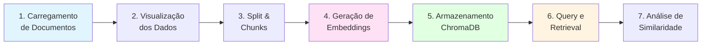
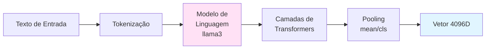
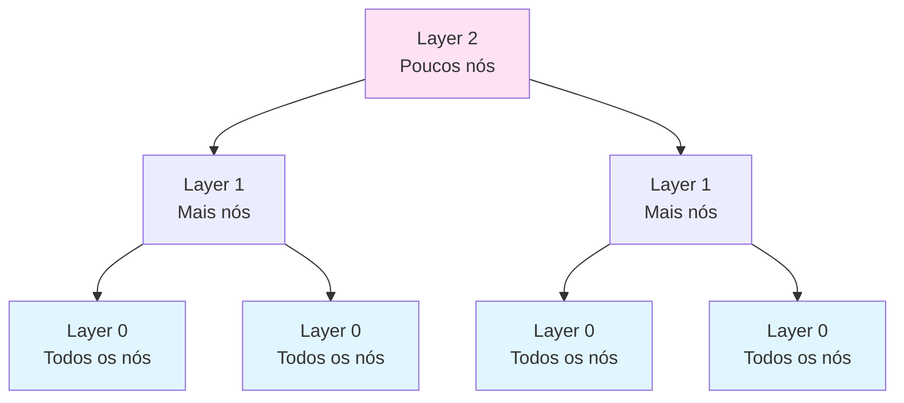

# Explicação Detalhada do Notebook RAG (rag.ipynb)

## Índice
1. [Visão Geral](#visão-geral)
2. [Estrutura do Notebook](#estrutura-do-notebook)
3. [Passo a Passo Detalhado](#passo-a-passo-detalhado)
4. [Conceitos Técnicos](#conceitos-técnicos)
5. [Exemplos e Resultados](#exemplos-e-resultados)
6. [Comparação com a Aplicação CLI](#comparação-com-a-aplicação-cli)

---

## Visão Geral

O notebook `rag.ipynb` é uma demonstração interativa e educacional do pipeline RAG (Retrieval-Augmented Generation). Ele ilustra todos os passos do processo, desde o carregamento de documentos até a busca por similaridade, de forma visual e experimentável.

### Objetivo Educacional

Este notebook serve para:
- Demonstrar o funcionamento interno do RAG
- Visualizar embeddings e suas dimensões
- Testar diferentes queries e avaliar resultados
- Compreender o conceito de similaridade semântica

---

## Estrutura do Notebook

### Fluxo Geral



### Células do Notebook

| Célula | Tipo | Descrição |
|--------|------|-----------|
| 1 | Code | Carregamento de documentos com TextLoader |
| 2 | Code | Visualização dos metadados |
| 3 | Markdown | Explicação sobre Split & Chunks |
| 4 | Code | Divisão em chunks com RecursiveCharacterTextSplitter |
| 5 | Markdown | Explicação sobre embeddings |
| 6 | Code | Geração de embeddings com Ollama |
| 7 | Code | Inicialização do ChromaDB |
| 8 | Markdown | Explicação sobre indexação |
| 9 | Code | Adição de documentos ao vectorstore |
| 10 | Markdown | Explicação sobre queries |
| 11 | Code | Busca com retriever (MMR) |
| 12 | Code | Busca com scores de similaridade |

---

## Passo a Passo Detalhado

### Passo 1: Carregamento de Documentos

```python
from langchain_community.document_loaders import TextLoader

docs = None
anamnese1 = "./data/anamnese/anamnese1.txt"
loader = TextLoader(anamnese1)
docs = loader.load()

print(len(docs))  # Output: 1
```

**O que acontece:**
- `TextLoader` lê o arquivo de texto
- Retorna lista de objetos `Document`
- Cada documento tem `page_content` (texto) e `metadata` (metadados)

**Resultado:**
- 1 documento carregado (arquivo inteiro como um único documento)

**Metadados extraídos:**
```python
{'source': './data/anamnese/anamnese1.txt'}
```

---

### Passo 2: Visualização dos Dados

```python
print(f"{docs[0].page_content[:200]}\n")
print(docs[0].metadata)
```

**Output:**
```
Anamnese Médica — Caso Clínico J.G.

## Identificação
- Nome: J.G.
- Idade: 72 anos
- Naturalidade: Junqueira (SP)
- Residência: Zona urbana de Campo Grande (MS)
- Estado civil: Casado
- Profissão: Ag

{'source': './data/anamnese/anamnese1.txt'}
```

**Propósito:**
- Verificar se o documento foi carregado corretamente
- Inspecionar estrutura e formato do texto

---

### Passo 3: Split & Chunks

#### Por que dividir em chunks?

Documentos longos precisam ser divididos porque:
1. Modelos de embedding têm limite de tokens
2. Chunks menores melhoram a precisão da busca
3. Retrieval de chunks é mais eficiente que documentos inteiros
4. Permite encontrar informações específicas

#### Código:

```python
from langchain_text_splitters import RecursiveCharacterTextSplitter

text_splitter = RecursiveCharacterTextSplitter(
    chunk_size=1000,        # Tamanho máximo de cada chunk
    chunk_overlap=200,      # Overlap entre chunks
    add_start_index=True    # Adiciona índice de início
)
all_splits = text_splitter.split_documents(docs)

print(f"{len(all_splits)} chunks")  # Output: 6 chunks
```

#### Parâmetros Explicados:

| Parâmetro | Valor | Explicação |
|-----------|-------|------------|
| `chunk_size` | 1000 | Máximo de caracteres por chunk |
| `chunk_overlap` | 200 | Caracteres compartilhados entre chunks consecutivos |
| `add_start_index` | True | Adiciona metadata com posição no documento original |

#### Por que usar overlap?

```
Documento: "ABCDEFGHIJKLMNOPQRSTUVWXYZ"

Sem overlap (chunk_size=10):
Chunk 1: "ABCDEFGHIJ"
Chunk 2: "KLMNOPQRST"
Chunk 3: "UVWXYZ"

Com overlap (chunk_size=10, overlap=3):
Chunk 1: "ABCDEFGHIJ"
Chunk 2: "HIJKLMNOPQ"  ← HIJ são compartilhados
Chunk 3: "OPQRSTUVWX"  ← OPQ são compartilhados
Chunk 4: "WXYZ"        ← WX são compartilhados
```

**Vantagens do overlap:**
- Evita perda de contexto nas bordas
- Melhora recuperação de frases que cruzam limites de chunks
- Aumenta chances de match em buscas

**Resultado:**
- Documento original → 6 chunks de ~1000 caracteres cada
- Cada chunk mantém contexto com chunks vizinhos

---

### Passo 4: Visualização dos Vetores de Embedding

#### O que são embeddings?

Embeddings são representações numéricas (vetoriais) de texto que capturam significado semântico em um espaço multidimensional.

#### Código:

```python
from langchain_ollama import OllamaEmbeddings

llama = OllamaEmbeddings(model="llama3")

vector_1 = llama.embed_query(all_splits[0].page_content)
vector_2 = llama.embed_query(all_splits[1].page_content)

assert len(vector_1) == len(vector_2)
print(f"Generated vectors of length {len(vector_1)}\n")
print(vector_1[:10])
```

**Output:**
```
Generated vectors of length 4096

[-0.017400112, -0.023161422, -0.006027748, 0.00832438,
 0.020338401, -0.010137265, -0.028223205, 0.005838734,
 -0.025189139, 0.0021824331]
```

#### Características dos Embeddings:

| Propriedade | Valor | Significado |
|-------------|-------|-------------|
| **Dimensionalidade** | 4096 | Cada texto vira um vetor de 4096 números |
| **Consistência** | Fixo | Sempre 4096, independente do tamanho do texto |
| **Range** | ~[-1, 1] | Valores normalizados |
| **Modelo** | llama3 | Modelo usado para gerar embeddings |

#### Visualização Conceitual:

```
Texto 1: "Paciente com hematúria"
         ↓ [Embedding Model]
Vector 1: [-0.017, -0.023, -0.006, ..., 0.021] (4096 dims)

Texto 2: "Identificação do paciente"
         ↓ [Embedding Model]
Vector 2: [0.012, -0.031, 0.008, ..., -0.015] (4096 dims)

Similaridade = cosine_similarity(Vector 1, Vector 2)
```

#### Por que 4096 dimensões?

- Maior dimensionalidade = mais informação capturada
- llama3 usa 4096 dims por design
- Trade-off: precisão vs. eficiência computacional

---

### Passo 5: Inicialização do ChromaDB

```python
from langchain_chroma import Chroma

vector_store = Chroma(
    collection_name="my_collection",
    embedding_function=llama,
    persist_directory="./chromadb_notebook",
)
```

#### Parâmetros:

| Parâmetro | Valor | Função |
|-----------|-------|--------|
| `collection_name` | "my_collection" | Nome da coleção (como tabela em DB) |
| `embedding_function` | llama | Função para gerar embeddings |
| `persist_directory` | "./chromadb_notebook" | Onde salvar dados persistentes |

#### O que é ChromaDB?

ChromaDB é um banco de dados vetorial que:
- Armazena embeddings de forma eficiente
- Permite busca por similaridade em alta velocidade
- Usa índices especializados (HNSW - Hierarchical Navigable Small World)
- Persiste dados em disco

---

### Passo 6: Indexação dos Chunks

```python
ids = vector_store.add_documents(documents=all_splits)
```

**O que acontece internamente:**

1. Para cada chunk em `all_splits`:
   ```python
   text = chunk.page_content
   ```

2. Gera embedding:
   ```python
   vector = llama.embed_query(text)  # 4096 dims
   ```

3. Armazena no ChromaDB:
   ```python
   chromadb.add(
       ids=[auto_generated_id],
       embeddings=[vector],
       metadatas=[chunk.metadata],
       documents=[text]
   )
   ```

**Resultado:**
- 6 chunks indexados
- Cada um com seu embedding de 4096 dimensões
- Prontos para busca por similaridade

#### Estrutura Interna do ChromaDB:

```
Collection: my_collection
├── Document 1
│   ├── id: "uuid-1"
│   ├── embedding: [4096 floats]
│   ├── metadata: {"source": "...", "start_index": 0}
│   └── content: "Anamnese Médica — Caso..."
├── Document 2
│   ├── id: "uuid-2"
│   ├── embedding: [4096 floats]
│   ├── metadata: {"source": "...", "start_index": 317}
│   └── content: "## Queixa Principal..."
...
```

---

### Passo 7: Query - Retrieval com MMR

#### Código:

```python
retriever = vector_store.as_retriever(
    search_type="mmr",
    search_kwargs={"k": 5, "lambda_mult": 0.25}
)

retriever.invoke("Qual é a Identificação do paciente?")
```

#### O que é MMR (Maximal Marginal Relevance)?

MMR é um algoritmo que balanceia:
1. **Relevância**: Quão similar o documento é à query
2. **Diversidade**: Quão diferentes os documentos são entre si

**Fórmula:**
```
MMR = λ × Similaridade(query, doc) - (1-λ) × max Similaridade(doc, docs_selecionados)
```

#### Parâmetros:

| Parâmetro | Valor | Significado |
|-----------|-------|-------------|
| `search_type` | "mmr" | Usa algoritmo MMR |
| `k` | 5 | Retorna top-5 documentos |
| `lambda_mult` | 0.25 | λ=0.25 → 25% relevância, 75% diversidade |

#### Lambda (λ) Explicado:

```
λ = 1.0  → 100% relevância, 0% diversidade (similarity puro)
λ = 0.5  → 50% relevância, 50% diversidade (balanceado)
λ = 0.25 → 25% relevância, 75% diversidade (máxima variedade)
λ = 0.0  → 0% relevância, 100% diversidade (máxima diferença)
```

**Por que usar MMR?**
- Evita retornar documentos muito similares entre si
- Garante cobertura de diferentes aspectos da query
- Útil quando há chunks redundantes

#### Resultado:

Retorna 5 documentos ordenados por MMR score:

```python
[
    Document(id='...', metadata={...}, page_content='...'),
    Document(id='...', metadata={...}, page_content='...'),
    ...
]
```

---

### Passo 8: Query - Similarity Search com Scores

#### Código:

```python
response = vector_store.similarity_search_with_score(
    query="Qual é a qualificação completa do paciente J.G?",
    k=5
)

for doc, score in response:
    print(f"Score: {score}\n")
```

#### Output:

```
Score: 0.6582279205322266
Score: 0.8941496014595032
Score: 0.9753409028053284
Score: 0.9754365682601929
Score: 1.6619325876235962
```

#### O que é Similarity Search?

Busca por similaridade coseno entre vetores:

```
Similaridade = cosine_similarity(embedding_query, embedding_documento)
```

**Cálculo:**
```
cos(θ) = (A · B) / (||A|| × ||B||)

Onde:
- A = embedding da query
- B = embedding do documento
- · = produto escalar
- ||A|| = norma euclidiana de A
```

#### Interpretação dos Scores:

| Score | Distância | Interpretação |
|-------|-----------|---------------|
| **0.658** | Muito próximo | Alta similaridade - documento muito relevante |
| **0.894** | Próximo | Boa similaridade - documento relevante |
| **0.975** | Moderado | Similaridade razoável |
| **0.975** | Moderado | Similaridade razoável |
| **1.662** | Distante | Baixa similaridade - menos relevante |

**Nota:** ChromaDB retorna **distância**, não similaridade direta:
- Menor distância = maior similaridade
- Score 0.0 = vetores idênticos
- Scores maiores = menos similares

#### Por que o primeiro documento é mais relevante?

Query: "Qual é a qualificação completa do paciente J.G?"

Documento com score 0.658 contém:
```
## Identificação
- Nome: J.G.
- Idade: 72 anos
- Naturalidade: Junqueira (SP)
- Residência: Zona urbana de Campo Grande (MS)
- Estado civil: Casado
- Profissão: Agrimensor por 32 anos...
- Escolaridade: Ensino médio completo
```

**Match semântico:**
- "qualificação" ≈ "profissão", "escolaridade"
- "paciente J.G." ≈ "Nome: J.G."
- "completa" ≈ todas as informações de identificação

---

## Conceitos Técnicos

### 1. Embeddings

#### Definição Técnica

Embeddings são mapeamentos de objetos discretos (palavras, frases, documentos) para vetores em um espaço contínuo de alta dimensionalidade, onde a distância/similaridade vetorial corresponde à similaridade semântica.

#### Como são Gerados?



**Processo detalhado:**

1. **Tokenização**: Texto → tokens
   ```
   "Paciente com hematúria" → [101, 5231, 1254, 7892, 102]
   ```

2. **Embedding Layer**: Tokens → vetores iniciais
   ```
   [101, 5231, ...] → [[-0.2, 0.5, ...], [0.1, -0.3, ...], ...]
   ```

3. **Transformer Layers**: Contexto e relacionamentos
   ```
   32 camadas de self-attention + feed-forward
   ```

4. **Pooling**: Agregar em um único vetor
   ```
   Mean pooling: média de todos os vetores de tokens
   ```

5. **Normalização**: Vetor final normalizado
   ```
   v_final = v / ||v||  (norma L2)
   ```

#### Propriedades dos Embeddings:

1. **Similaridade Semântica**
   ```
   embedding("médico") ≈ embedding("doutor")
   embedding("hematúria") ≈ embedding("sangue na urina")
   ```

2. **Operações Vetoriais**
   ```
   embedding("rei") - embedding("homem") + embedding("mulher") ≈ embedding("rainha")
   ```

3. **Clustering**
   ```
   Documentos sobre mesmo tópico formam clusters no espaço vetorial
   ```

---

### 2. Busca por Similaridade

#### Algoritmos de Busca

##### A. Brute Force (Força Bruta)

```python
def brute_force_search(query_vector, all_vectors, k=5):
    distances = []
    for vec in all_vectors:
        dist = cosine_distance(query_vector, vec)
        distances.append(dist)
    return sorted(distances)[:k]
```

**Complexidade:** O(n) - linear no número de documentos

##### B. HNSW (Hierarchical Navigable Small World)

ChromaDB usa HNSW, um grafo hierárquico que permite busca em ~O(log n):



**Vantagens:**
- Busca muito rápida em grandes volumes
- Trade-off entre precisão e velocidade
- Escalável para milhões de vetores

---

### 3. Métricas de Distância/Similaridade

#### A. Cosine Similarity

```python
import numpy as np

def cosine_similarity(a, b):
    return np.dot(a, b) / (np.linalg.norm(a) * np.linalg.norm(b))
```

**Range:** [-1, 1]
- 1 = vetores idênticos
- 0 = vetores ortogonais (não relacionados)
- -1 = vetores opostos

**Uso:** Embeddings normalizados (mais comum)

#### B. Euclidean Distance

```python
def euclidean_distance(a, b):
    return np.linalg.norm(a - b)
```

**Range:** [0, ∞]
- 0 = vetores idênticos
- Maior = mais distantes

**Uso:** Quando magnitude importa

#### C. Dot Product

```python
def dot_product(a, b):
    return np.dot(a, b)
```

**Range:** (-∞, ∞)

**Uso:** Vetores já normalizados

---

## Exemplos e Resultados

### Exemplo 1: Query Específica

**Query:** "Qual é a identificação do paciente?"

**Embeddings:**
```python
query_embedding = llama.embed_query("Qual é a identificação do paciente?")
# Vetor de 4096 dimensões
```

**Top-3 Resultados:**

| Rank | Score | Conteúdo |
|------|-------|----------|
| 1 | 0.658 | "## Identificação\n- Nome: J.G.\n- Idade: 72 anos..." |
| 2 | 0.894 | "## Queixa Principal (QP)\n- Urina com sangue..." |
| 3 | 0.975 | "## História Médica Pregressa..." |

**Análise:**
- Resultado 1: Match exato com seção "Identificação"
- Resultado 2: Contexto relacionado ao paciente
- Resultado 3: Informações complementares

---

### Exemplo 2: Query Médica Específica

**Query:** "Qual foi a queixa principal do paciente?"

**Top-3 Resultados:**

| Rank | Score | Conteúdo |
|------|-------|----------|
| 1 | 0.512 | "## Queixa Principal (QP)\n- Urina com sangue há 8 dias (hematúria)" |
| 2 | 0.823 | "## História da Doença Atual (HDA)..." |
| 3 | 0.956 | "## Identificação\n- Nome: J.G..." |

**Por que funciona?**
- "queixa principal" → seção explícita "Queixa Principal (QP)"
- Modelo entende sinônimos e contexto médico
- HDA é contextualmente relacionado à queixa

---

### Exemplo 3: Visualização de Embeddings

Para visualizar embeddings em 2D, podemos usar t-SNE ou UMAP:

```python
from sklearn.manifold import TSNE
import matplotlib.pyplot as plt

# Reduzir de 4096D para 2D
embeddings_2d = TSNE(n_components=2).fit_transform(all_embeddings)

plt.scatter(embeddings_2d[:, 0], embeddings_2d[:, 1])
plt.title("Embeddings dos Chunks em 2D")
plt.show()
```

**Resultado esperado:**
- Chunks similares ficam próximos
- Chunks sobre "identificação" formam cluster
- Chunks sobre "queixa/doença" formam outro cluster

---

## Comparação com a Aplicação CLI

### Notebook vs. CLI

| Aspecto | Notebook (rag.ipynb) | Aplicação CLI (simple_rag) |
|---------|----------------------|----------------------------|
| **Propósito** | Educacional/Experimentação | Produção/Uso prático |
| **Interatividade** | Células individuais | Loop conversacional |
| **Persistência** | `./chromadb_notebook` | `./chromadb` |
| **Ferramentas** | Apenas retrieval | Retrieval + calculadora |
| **Agente** | Não usa LangGraph | Usa LangGraph agent |
| **LLM** | Não integrado | ChatOllama llama3.1:8b |
| **Histórico** | Não mantém | Não mantém (pode adicionar) |
| **Logging** | Print direto | Logger estruturado |

### Fluxo Comparado

#### Notebook:
```
Query → Retriever → Resultados → [Usuário analisa]
```

#### CLI:
```
Query → Agent → LLM → Tool Call → Retriever → Results → LLM → Resposta Natural
```

### Quando usar cada um?

**Notebook:**
- Aprendizado sobre RAG
- Testes de parâmetros (k, lambda, chunk_size)
- Debug de embeddings
- Análise de scores

**CLI:**
- Uso prático diário
- Conversação natural
- Integração com outros sistemas
- Produção

---

## Exercícios Práticos

### 1. Testar Diferentes Valores de k

```python
# No notebook, teste:
for k in [1, 3, 5, 10]:
    results = vector_store.similarity_search("identificação", k=k)
    print(f"k={k}: {len(results)} resultados")
```

**Questão:** Qual k oferece melhor balanço entre precisão e recall?

---

### 2. Comparar MMR vs. Similarity

```python
# MMR
mmr_results = vector_store.max_marginal_relevance_search(
    "paciente", k=5, lambda_mult=0.25
)

# Similarity
sim_results = vector_store.similarity_search("paciente", k=5)

# Compare os resultados
```

**Questão:** Quais documentos aparecem em um mas não no outro?

---

### 3. Visualizar Impacto do Chunk Size

```python
# Teste diferentes tamanhos
for size in [500, 1000, 2000]:
    splitter = RecursiveCharacterTextSplitter(
        chunk_size=size,
        chunk_overlap=200
    )
    splits = splitter.split_documents(docs)
    print(f"Chunk size {size}: {len(splits)} chunks")
```

**Questão:** Como chunk size afeta o número de chunks e qualidade dos resultados?

---

### 4. Análise de Scores

```python
query = "história médica do paciente"
results = vector_store.similarity_search_with_score(query, k=10)

import matplotlib.pyplot as plt
scores = [score for _, score in results]
plt.bar(range(len(scores)), scores)
plt.title("Distribuição de Scores de Similaridade")
plt.xlabel("Documento")
plt.ylabel("Score")
plt.show()
```

**Questão:** Há um gap claro entre documentos relevantes e irrelevantes?

---

## Recursos Adicionais

### Leituras Recomendadas

1. **RAG Fundamentals**
   - [LangChain RAG Tutorial](https://python.langchain.com/docs/tutorials/rag/)
   - [Pinecone RAG Guide](https://www.pinecone.io/learn/retrieval-augmented-generation/)

2. **Embeddings**
   - [OpenAI Embeddings Guide](https://platform.openai.com/docs/guides/embeddings)
   - [Sentence Transformers](https://www.sbert.net/)

3. **Vector Databases**
   - [ChromaDB Documentation](https://docs.trychroma.com/)
   - [HNSW Algorithm](https://arxiv.org/abs/1603.09320)

### Ferramentas de Visualização

- **Embedding Projector**: [projector.tensorflow.org](https://projector.tensorflow.org/)
- **t-SNE**: [scikit-learn.org](https://scikit-learn.org/stable/modules/generated/sklearn.manifold.TSNE.html)
- **UMAP**: [umap-learn.readthedocs.io](https://umap-learn.readthedocs.io/)

---

## Conclusão

O notebook `rag.ipynb` demonstra os fundamentos do RAG de forma interativa:

1. **Carregamento** de documentos
2. **Divisão** em chunks
3. **Geração** de embeddings
4. **Armazenamento** em vector database
5. **Busca** por similaridade

Estes conceitos são a base da aplicação CLI, que adiciona:
- Agente LangGraph
- LLM para geração de respostas
- Interface conversacional

Experimentar com o notebook ajuda a entender o funcionamento interno antes de usar o sistema completo.

---

## Perguntas Frequentes (FAQ)

### 1. Por que usar 1000 caracteres para chunk_size?

- Balanço entre contexto e precisão
- Muito pequeno: perde contexto
- Muito grande: dificulta busca específica
- 1000 é um valor empírico que funciona bem

### 2. O que acontece se eu usar lambda=1.0 no MMR?

Lambda=1.0 equivale a similarity search pura (sem diversidade).

### 3. Por que os scores não estão entre 0 e 1?

ChromaDB retorna distância (L2 ou cosine distance), não similaridade direta. Menor score = mais similar.

### 4. Posso usar outros modelos de embedding?

Sim! Basta trocar:
```python
from langchain_huggingface import HuggingFaceEmbeddings
embeddings = HuggingFaceEmbeddings(model_name="all-MiniLM-L6-v2")
```

### 5. Como adicionar mais documentos ao vectorstore?

```python
new_docs = loader.load()
new_splits = text_splitter.split_documents(new_docs)
vector_store.add_documents(new_splits)
```

---

**Autor:** Flavio
**Data:** 2025
**Disciplina:** Processamento de Linguagem Natural - PUC Minas
